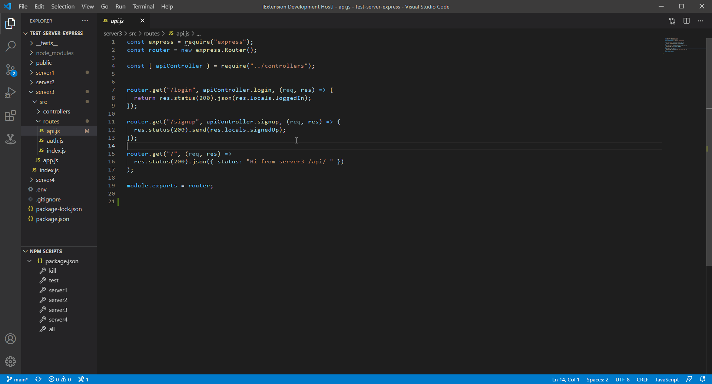
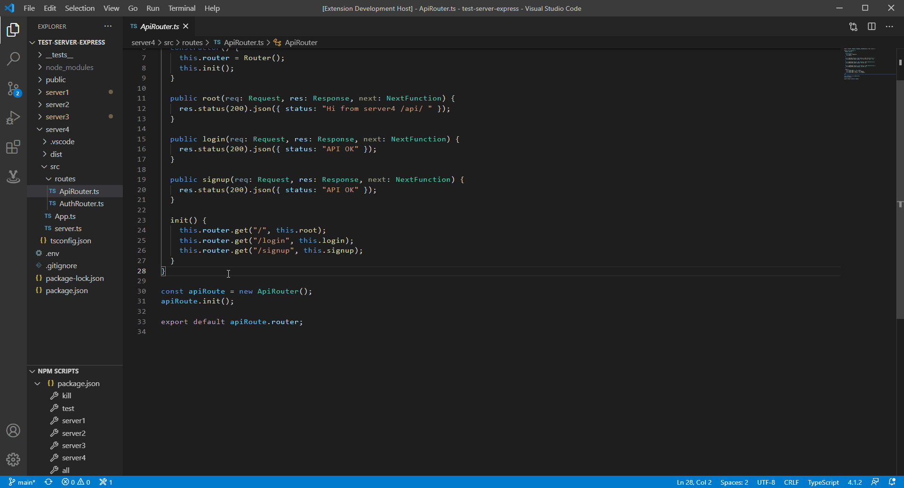

## reVerb for Visual Studio Code   

The reVerb extension is a RESTful api client for Visual Studio Code that offers an interactive GUI for testing Express endpoints, without ever having to leave the editor.

Warning! reVerb is in pre-alpha. Please understand things may not always work as intended.
You can always completely wipe all saved route data in settings > ERASE to start fresh.

Full documentation is on the way!
