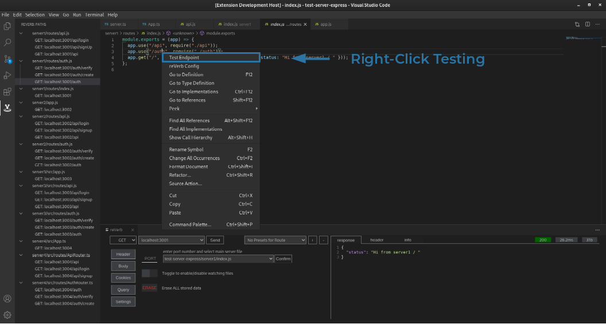
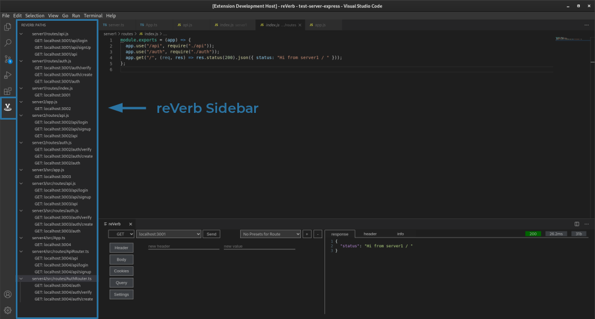
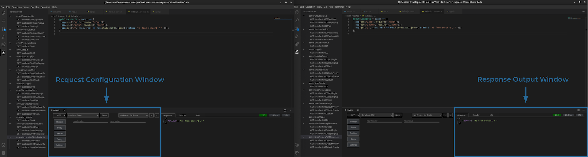

<meta name='keywords' content='rest, reVerb, vscode, vscode-extension'>

<!-- # duolog-vscode-extension -->

<h2 align="center">A Visual Studio Code Extension For Testing Express Server Endpoints
</h2>

  <em>
    JavaScript
    · TypeScript
    · REST API
  </em>
   
  <em>
    CSS
    · SCSS
  </em>
   
  <em>
    HTML
    · React
    · Redux
  </em>
   
  <em>
    Travis CI
    · Mocha
  </em>
   

## Intro

reVerb is a RESTful api client for Visual Studio Code that offers an interactive GUI for testing Express endpoints, without ever having to leave the editor.

## Features

reVerb automatically detects all routes handled by your server, making testing as simple as right clicking on the route itself.

 

A global list of all endpoints is displayed in the reVerb Sidebar, which gives the front-end team instant visibility to all routes and their expected configurations. In addition, you can generate an Axios request for any of the listed routes with a simple mouse click. The list dynamically updates in response to changes.

 

Click on the route to open the file which contains it.

 

The Request Configuration Window is an interactive GUI that allows you to generate and test server requests, all within VS Code. After a request is sent, the Response Output Window displays the response, status, headers, and other information.

 

Automatically detect all endpoints on a given file

 

Use the Watcher to dynamically monitor your Express routes and display the current status inline.

 

## Contributors

<h4>Sean Arseneault <a href='https://github.com/itsmesean' target=“_blank”>@github </a><a href= # target=“_blank”>@linkedin</a></h4>
<h4>Amir Marcel <a href='https://github.com/amirmarcel' target=“_blank”>@github </a><a  href='https://www.linkedin.com/in/amir-marcel/' target=“_blank”>@linkedin</a></h4>
<h4>Christopher Johnson <a href='https://github.com/CJLA' target=“_blank”>@github </a><a  href='https://www.linkedin.com/in/thecjjohnson/' target=“_blank”>@linkedin</a></h4>
<h4>Corey Van Splinter <a href='https://github.com/cvanspl1' target=“_blank”>@github </a><a href='https://www.linkedin.com/in/corey-van-splinter/' target=“_blank”>@linkedin</a></h4>
