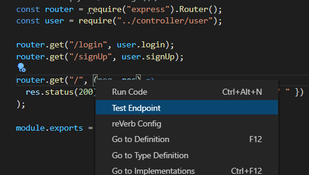
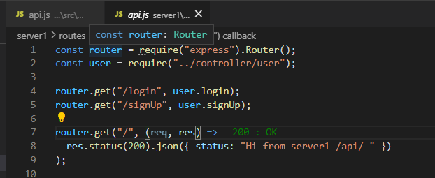

<h2 align="center">A VS Code extension for testing server endpoints</h2>

  <em>
    JavaScript
    · TypeScript
    · REST API
  </em>
   
  <em>
    CSS
    · SCSS
  </em>
   
  <em>
    HTML
    · React
    · Redux
  </em>
   
  <em>
    Travis CI
    · Gulp
    · Mocha
  </em>
   

## Intro

Reverb is a VS Code extension that allows for testing and managing Express endpoints within VS Code. All routes handled by running Express servers are automatically detected, making testing as simple as right clicking on the route.

